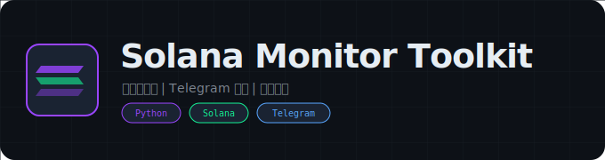

<div align="center">
  

  # Solana Monitor Toolkit

  **Solana 聪明钱监控与 Telegram 预警系统**

  [](https://python.org)
  [](https://solana.com)
  [](https://core.telegram.org/bots)
  [](LICENSE)
</div>

---

## 项目概述

Solana Monitor Toolkit 是一个基于 GMGN API 的 Solana 链上聪明钱（Smart Money）监控与 Telegram 预警系统。系统从 GMGN 获取 7 天内活跃的聪明钱钱包地址列表，通过线程池并发监控这些钱包的最新买入交易，当检测到某代币有超过 3 个聪明钱在买入时，自动通过 Telegram Bot 发送预警消息到指定频道。另外包含一个独立的 Binance 全币种技术指标监控脚本（布林带 + RSI）。

## 技术栈

- **GMGN API**: 聪明钱钱包排名、钱包交易活动、代币交易记录查询
- **pyTelegramBotAPI**: Telegram Bot 预警消息推送
- **threading + ThreadPoolExecutor**: 多线程并发钱包监控（最大 20 线程）
- **queue.Queue**: 线程安全的数据队列
- **ccxt**: Binance 交易所 K 线数据获取
- **ta**: 技术指标计算（布林带、RSI）
- **pandas**: K 线数据处理

## 功能特性

### 聪明钱监控
- **钱包地址自动更新** -- 从 GMGN API 获取 `smart_degen` 和 `pump_smart` 两类聪明钱排名，筛选 24 小时内活跃的钱包
- **并发交易监控** -- 线程池（20 线程）并发查询所有聪明钱钱包的最新买入交易
- **聪明钱计数** -- 对每个代币统计有多少个不同的聪明钱地址在交易
- **时间过滤** -- 仅处理 12 分钟内的新交易，避免推送过时信息
- **去重机制** -- 使用 `set()` 记录已发送消息，避免重复推送

### Telegram 预警
- **自动推送** -- 当聪明钱数量 > 3 时，自动发送预警到 Telegram 频道
- **格式化消息** -- 包含代币名称、购买价格、购买金额、小时交易量、合约地址等信息
- **K 线快捷链接** -- 消息附带 GMGN K 线图内联按钮，一键查看
- **Markdown 格式** -- 合约地址使用代码格式，方便一键复制

### 价格格式化
- **极小数值处理** -- 对 Meme 币常见的极小价格（如 0.000000001234）使用简化表示法
- **科学计数法** -- 自动将连续零简化为 `0.0{N}X` 格式

### 技术指标监控（独立脚本）
- **全币种扫描** -- 通过 ccxt 获取 Binance 所有交易对
- **布林带检测** -- 检测价格突破布林带上轨/下轨
- **RSI 指标** -- 计算并输出每个交易对的 RSI 值
- **5 分钟周期** -- 每 5 分钟扫描一轮所有交易对

## 安装说明

1. 克隆仓库到本地：
   ```bash
   git clone https://github.com/Past-Tang/solana-monitor-toolkit.git
   cd solana-monitor-toolkit
   ```

2. 安装依赖：
   ```bash
   pip install requests pyTelegramBotAPI ccxt pandas ta
   ```

3. 配置 Telegram Bot Token：
   编辑 `utils/solana_telegram_bot.py` 中的 `BOT_TOKEN`

4. 更新聪明钱钱包列表：
   ```bash
   python utils/solana_contract_verifier.py
   ```

## 使用方法

### 启动聪明钱监控
```bash
python solana_monitor_main.py
```

### 更新聪明钱钱包地址
```bash
python utils/solana_contract_verifier.py
```

### 启动 Binance 技术指标监控
```bash
python solana_wallet_generator.py
```

## 项目结构

```
solana-monitor-toolkit/
├── solana_monitor_main.py                # 主监控程序（106行）：线程池 + 队列 + Telegram 推送
├── solana_wallet_generator.py            # Binance 技术指标监控（88行）：布林带 + RSI
├── run/
│   └── solana_transaction_monitor.py     # 钱包交易数据获取（46行）
├── utils/
│   ├── solana_contract_verifier.py       # 聪明钱钱包地址更新（82行）
│   ├── solana_telegram_bot.py            # Telegram Bot 预警推送（91行）
│   ├── solana_token_handler.py           # 代币聪明钱计数（33行）
│   └── solana_price_formatter.py         # 价格格式化工具（45行）
├── data/
│   └── smart_wallets.txt                 # 聪明钱钱包地址列表
├── assets/
│   └── logo.svg                          # 项目 Logo
├── LICENSE                               # MIT 许可证
└── README.md
```

## 核心流程

```
[聪明钱地址更新]
GMGN API (smart_degen + pump_smart 排名)
  -> 筛选 24h 内活跃钱包
  -> 合并去重
  -> 写入 data/smart_wallets.txt

[实时监控]
读取 smart_wallets.txt
  -> 线程池（20线程）并发查询每个钱包最新买入
  -> 对每笔交易查询代币的聪明钱数量
  -> 数据放入 Queue
  -> 后台线程消费 Queue:
     ├── 过滤 12 分钟前的旧交易
     ├── 去重检查
     ├── 聪明钱数量 > 3 -> Telegram 推送预警
     └── 等待 3.5 秒（防频率限制）
  -> 每轮间隔 5 秒
```

## GMGN API 接口

| 接口 | 用途 |
|:---|:---|
| `/rank/sol/wallets/7d?tag=smart_degen` | 获取聪明钱排名（smart_degen） |
| `/rank/sol/wallets/7d?tag=pump_smart` | 获取聪明钱排名（pump_smart） |
| `/wallet_activity/sol?type=buy&wallet=X` | 获取钱包买入交易记录 |
| `/trades/sol/{token}?tag[]=smart_degen` | 获取代币的聪明钱交易记录 |

## 依赖项

| 包 | 用途 |
|:---|:---|
| requests | HTTP 请求（GMGN API） |
| pyTelegramBotAPI | Telegram Bot 消息推送 |
| ccxt | Binance 交易所数据获取 |
| pandas | K 线数据处理 |
| ta | 技术指标计算 |

## 常见问题

### GMGN API 返回错误？
GMGN 可能有反爬机制，系统使用模拟 Googlebot User-Agent。如果频繁请求被限制，可以增加请求间隔。

### Telegram 消息发送失败？
检查 Bot Token 是否正确，确保 Bot 已被添加到目标频道并具有发送消息权限。

### 聪明钱钱包列表为空？
运行 `python utils/solana_contract_verifier.py` 更新钱包列表。确保网络可以访问 GMGN API。

## 安全注意事项

- Telegram Bot Token 硬编码在代码中，生产环境应迁移到环境变量
- GMGN API 请求使用模拟 User-Agent，可能违反其服务条款
- 聪明钱预警仅供参考，不构成投资建议

## 许可证

[MIT License](LICENSE)

## 免责声明

本工具仅供学习研究使用，不构成任何投资建议。加密货币交易存在极高风险，聪明钱跟单策略不保证盈利。使用者需自行承担所有投资风险和损失。